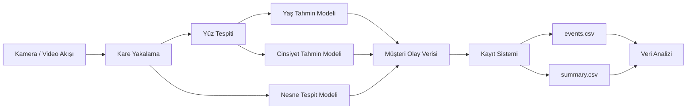

# 🧠 Yapay Zeka Tabanlı Müşteri Analiz Sistemi


Bu proje, kamera görüntülerini analiz ederek **müşteri davranışı hakkında veri üreten bir yapay zeka sistemidir**.

Sistem kamera görüntülerinden şu bilgileri tespit eder:

- 👤 **Müşteri yaş aralığı**
- 👥 **Müşteri cinsiyeti**
- 🕒 **Mağazaya geliş zamanı**
- 🛍 **Görüntüde bulunan ürün benzeri nesneler**

Tespit edilen tüm veriler **CSV formatında raporlanır** ve veri analizi için kullanılabilir.

---

# 📌 Projenin Amacı

Perakende mağazaları genellikle şu soruların cevabını bilmek ister:

- Müşteriler en çok hangi saatlerde geliyor?
- Kadın / erkek müşteri oranı nedir?
- Müşterilerin yaş dağılımı nedir?
- Kamera görüntülerinde en çok hangi ürünler görülüyor?

Bu proje, yalnızca **kamera görüntülerini kullanarak** bu bilgileri otomatik olarak üretmeyi amaçlar.

Elde edilen veriler şu alanlarda kullanılabilir:

- mağaza analizi
- pazarlama stratejileri
- ürün yerleşimi
- müşteri davranış analizi

---

# 🚀 Özellikler

✔ Gerçek zamanlı yüz tespiti  
✔ Yaş tahmin modeli  
✔ Cinsiyet tahmin modeli  
✔ COCO veri seti ile nesne tespiti  
✔ Kamera veya video dosyası desteği  
✔ CSV formatında rapor üretimi  
✔ Modüler Python proje yapısı  
✔ Genişletilebilir mimari  

---

# 🎥 Demo

Kamera üzerinden çalışan sistemin örnek çıktısı:

```
+----------------------------+
| Yüz tespit edildi          |
| Yaş: 25-32                 |
| Cinsiyet: Erkek            |
| Ürün: bottle               |
+----------------------------+
```

Gerçek ekran görüntüsü eklemek için:

```
docs/demo.png
```

dosyasını ekleyip README içine şu satırı koyabilirsiniz:

```

```

---

# 🧩 Sistem Mimarisi



---

# ⚙️ Kurulum

## Gereksinimler

- Python **3.9 veya üzeri**
- Kamera veya video kaynağı
- Windows / Linux / MacOS

---

## Sanal Ortam Oluşturma

```bash
python -m venv .venv
```

### Windows ortam aktivasyonu

```bash
.\.venv\Scripts\activate
```

### Bağımlılıkların kurulması

```bash
pip install -r requirements.txt
```

---

# 🧠 Model Eğitimi

Yaş ve cinsiyet tahmin modeli **FairFace veri seti** kullanılarak eğitilir.

```bash
python src/training/train.py --epochs 5 --batch-size 64
```

### Eğitim Parametreleri

| Parametre | Açıklama |
|----------|----------|
| epochs | Eğitim turu sayısı |
| batch-size | Aynı anda işlenen veri sayısı |

Eğitim tamamlandığında model şu klasöre kaydedilir:

```
models/age_gender_resnet18.pth
```

---

# 🎥 Kamera Demo Çalıştırma

Eğitilmiş modeli kullanarak gerçek zamanlı analiz başlatılır.

```bash
python src/inference/webcam_demo.py --model-path models/age_gender_resnet18.pth
```

Program çalışırken:

1. Kameradan görüntü alınır  
2. Yüzler tespit edilir  
3. Yaş ve cinsiyet tahmini yapılır  
4. Nesneler tespit edilir  
5. Tüm veriler raporlanır  

---

# 📊 Üretilen Raporlar

Program çalıştırıldığında `reports` klasöründe iki dosya oluşur.

---

## events.csv

Her tespit edilen müşteri için detaylı kayıt içerir.

| timestamp | age_range | gender | product | confidence |
|----------|-----------|--------|--------|-----------|

Örnek:

```
2026-03-10 14:22:11 , 25-32 , Male , bottle , 0.91
```

---

## summary.csv

Toplanan verilerin özet analizini içerir.

Gruplama kriterleri:

- saat
- yaş aralığı
- cinsiyet
- ürün

Örnek tablo:

| saat | yas_grubu | cinsiyet | urun | adet |
|-----|-----------|----------|------|------|

---

# 🎛 Kamera Parametreleri

Varsayılan kullanım:

```bash
python src/inference/webcam_demo.py
```

Kullanılabilecek parametreler:

| Parametre | Açıklama |
|----------|----------|
| --camera-index | kamera numarası |
| --video-path | kamera yerine video kullanır |
| --model-path | eğitilmiş model yolu |
| --output-dir | raporların kaydedileceği klasör |
| --face-skip | yüz tespitini N karede bir yapar |
| --product-skip | nesne tespitini N karede bir yapar |
| --product-score | nesne güven eşiği |
| --no-products | nesne tespitini kapatır |
| --no-display | görüntü penceresini kapatır |

---

# 📁 Proje Yapısı

```
src/
│
├── config.py
│
├── datasets/
│   └── fairface_dataset.py
│
├── models/
│   └── age_gender_model.py
│
├── training/
│   └── train.py
│
├── inference/
│   └── webcam_demo.py
│
└── utils/
    ├── metrics.py
    ├── transforms.py
    └── reporting.py
```

### config.py

Tüm sabit ayarlar ve klasör yollarını içerir.

### fairface_dataset.py

FairFace veri setini okuyarak PyTorch veri formatına dönüştürür.

### age_gender_model.py

ResNet18 tabanlı yaş ve cinsiyet tahmin modeli.

### transforms.py

Görüntü ön işleme ve veri dönüşümleri.

### metrics.py

Model doğruluk hesaplamaları.

### train.py

Model eğitim sürecini yönetir.

### webcam_demo.py

Gerçek zamanlı kamera analizi yapar.

### reporting.py

CSV raporlarını oluşturur.

---

# ⚡ Performans Optimizasyonu

Performansı artırmak için şu parametreler kullanılabilir:

```
--face-skip
--product-skip
```

Bu parametreler tespit işlemini her kare yerine belirli aralıklarla çalıştırır ve FPS artırır.

---

# 🧰 Kullanılan Teknolojiler

- Python
- PyTorch
- OpenCV
- Torchvision
- ResNet18
- COCO Object Detection
- FairFace Dataset

---

# 🔐 Gizlilik ve Etik Notu

Bu sistem kamera görüntülerinden veri üretmektedir.

Gerçek ortamlarda kullanılırken:

- kullanıcıların bilgilendirilmesi
- veri saklama politikalarının belirlenmesi
- **KVKK / GDPR düzenlemelerine uyulması**

gerekmektedir.

---

# 📈 Gelecek Geliştirmeler

İleride eklenebilecek özellikler ve geliştirmeler:

- mağazaya özel ürün tespit modeli  
- müşteri yeniden tanıma (re-identification) / ID tracking  
- Dedup optimizasyonları (aynı müşteri veya çok yakın kareleri filtreleme)  
- geliştirilmiş yüz tespiti (MTCNN / RetinaFace)  
- düşük ışık ve uzak mesafe için iyileştirme  
- mağaza içi ısı haritası (heatmap)  
- gerçek zamanlı dashboard ve grafikler  
- web tabanlı veya masaüstü GUI ile rapor ve kayıt görüntüleme  
- POS sistemi entegrasyonu  

Bu geliştirmeler hem **performans** hem **stabilite** hem de **kullanıcı deneyimi** açısından önemli olacak.

---

# 📄 Lisans

Bu proje **MIT Lisansı** altında yayınlanmıştır.

---

# 👨‍💻 Geliştirici

Bu proje **bilgisayarlı görü ve derin öğrenme teknikleri kullanılarak geliştirilen bir müşteri analiz sistemidir.**